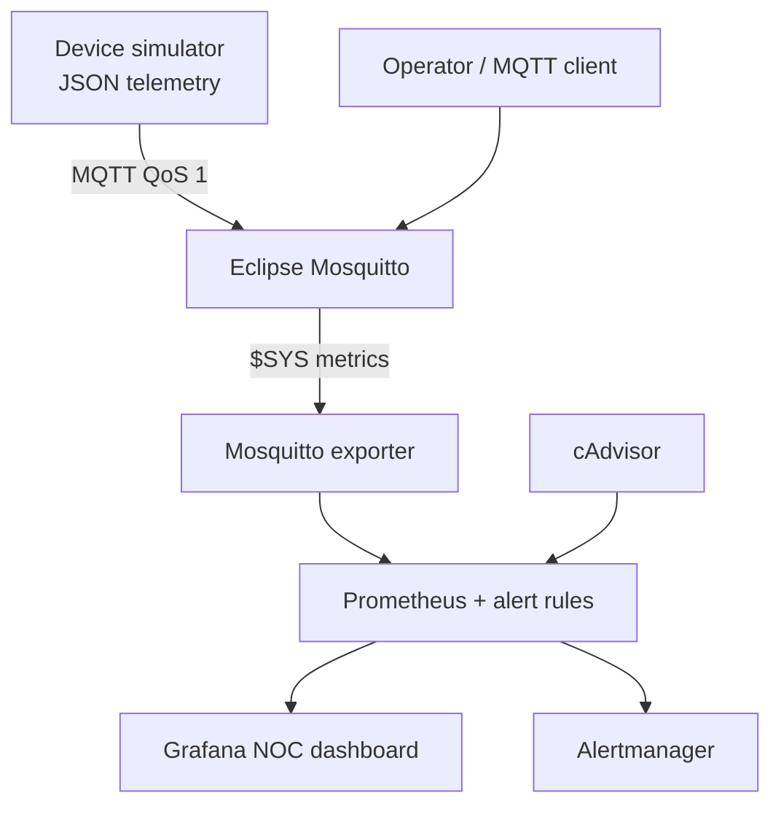

# IoT NOC Monitoring Lab

[](https://github.com/IzzaldinSamir/iot-noc-monitoring-lab/actions/workflows/ci.yml)
[](https://docs.docker.com/compose/)
[](https://prometheus.io/)
[](https://grafana.com/)
[](LICENSE)

A reproducible Docker Compose lab for practising NOC and L2 support workflows around an IoT MQTT service. It generates realistic device traffic, collects broker and container metrics, evaluates alerts, provisions an operations dashboard, and includes repeatable outage drills.

No manual Grafana setup is required: `make up` brings up the complete environment and `make smoke` verifies the data path end to end.

## What it demonstrates

- Service monitoring with Prometheus, cAdvisor, and a Mosquitto metrics exporter
- Dashboard-as-code with a provisioned Grafana data source and eight-panel NOC view
- Alert lifecycle management with Prometheus rules and Alertmanager
- MQTT troubleshooting across TCP, WebSockets, broker logs, `$SYS` metrics, and packet capture
- Operational automation with health checks, smoke tests, fault injection, and CI validation
- Reproducible deployments using pinned container versions, persistent volumes, and local-only port bindings

## Architecture



The simulator publishes temperature, humidity, battery, signal strength, sequence, and timestamp fields for a configurable fleet of devices. Infrastructure monitoring remains the focus: the dashboard tracks service health, MQTT throughput, clients, subscriptions, alerts, CPU, and memory.

## Quick start

### Requirements

- Linux host with Docker Engine and the Docker Compose plugin
- `curl` and `jq` for the health and smoke-test scripts
- `make` for the shortcut commands (optional)

```bash
git clone https://github.com/IzzaldinSamir/iot-noc-monitoring-lab.git
cd iot-noc-monitoring-lab

make up
make smoke
```

Without `make`:

```bash
cp .env.example .env
docker compose up -d --wait
./scripts/smoke-test.sh
```

Open [Grafana](http://localhost:3000). Anonymous access is read-only and the provisioned **IoT NOC Operations Overview** dashboard opens by default.

## Service endpoints

All published ports bind to `127.0.0.1` by default.

| Service | Local endpoint | Purpose |
|---|---|---|
| Grafana | <http://localhost:3000> | NOC dashboard |
| Prometheus | <http://localhost:9090> | Metrics, queries, and alert rules |
| Alertmanager | <http://localhost:9093> | Active alerts and silences |
| cAdvisor | <http://localhost:8080> | Container resource metrics |
| Mosquitto exporter | <http://localhost:9344/metrics> | MQTT broker metrics |
| MQTT | `localhost:1883` | MQTT TCP listener |
| MQTT WebSockets | `ws://localhost:9001` | Browser-compatible MQTT listener |

Copy `.env.example` to `.env` to change the Grafana admin password, bind address, simulated device count, or telemetry interval. `.env` is ignored by Git.

## Operational checks

Run the fast health check at any time:

```bash
./iot-healthcheck.sh
```

It validates five HTTP services, both MQTT listeners, and the state of all four Prometheus scrape targets. A failed check produces a non-zero exit code.

The deeper smoke test additionally proves:

- MQTT publish/subscribe round trip with QoS 1
- Grafana dashboard provisioning
- Prometheus rule loading
- Exporter and scrape-target availability

```bash
make smoke
```

## Incident drills

The drills deliberately stop one component so the alert path can be observed in Prometheus, Grafana, and Alertmanager.

```bash
# Stop device telemetry and trigger TelemetryTrafficSilent
make drill-traffic-stop

# Stop Mosquitto and trigger MosquittoBrokerUnavailable
make drill-broker-outage

# Restore the affected services
make recover
```

Use [RUNBOOK.md](RUNBOOK.md) for triage, packet-capture, recovery, and escalation steps.

## Validation and CI

```bash
make validate
```

The validation pipeline checks:

- Docker Compose rendering
- Prometheus configuration and alert rules with `promtool`
- Alert behaviour and timing with `promtool` rule fixtures
- Alertmanager configuration with `amtool`
- Shell syntax and ShellCheck findings
- Grafana dashboard JSON
- A live integration test of the complete stack

The same checks run in GitHub Actions for every push and pull request.

## Repository layout

```text
.
├── alertmanager/                # Alert routing configuration
├── grafana/
│   ├── dashboards/              # Version-controlled NOC dashboard
│   └── provisioning/            # Data source and dashboard providers
├── mosquitto/                   # MQTT listeners, persistence, and $SYS settings
├── prometheus/                  # Scrape configuration and alert rules
├── scripts/                     # Simulator, drills, smoke test, and validation
├── docker-compose.yml           # Seven-service lab topology
├── iot-healthcheck.sh           # Fast operator health check
└── RUNBOOK.md                   # L1/L2 incident-response procedures
```

## Security boundary

This is an isolated local lab, not a production Mosquitto deployment. MQTT anonymous access and Grafana anonymous viewer access are intentional for frictionless practice; Compose limits host exposure to loopback by default. Before using any part of the stack on another network, enable MQTT authentication and TLS, set a strong Grafana password, restrict firewall rules, and review the cAdvisor privileges.

## Common commands

| Command | Action |
|---|---|
| `make up` | Start the stack and wait for health checks |
| `make down` | Stop containers and preserve data volumes |
| `make reset` | Stop containers and delete lab volumes |
| `make ps` | Show service state |
| `make logs` | Follow logs from every service |
| `make health` | Run fast health checks |
| `make smoke` | Run the live integration test |
| `make validate` | Run all static configuration checks |

Built by [Izz al-Din Samir](https://github.com/IzzaldinSamir).
